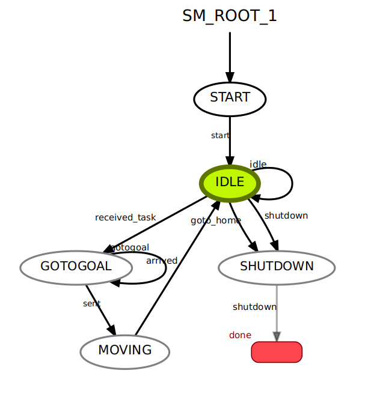

.. _overview:

*********************************
Overview of nav_bot package
*********************************

This is a toy project designed to allow a user to send goals to a turtlebot3 burger. It also has the functionality to send the robot back to the starting position (called "home"). The project is intended to be run in Gazebo simulation and shows the robot making path plans on rviz. The ROS smach state machine is used to control the turtlebot3 and has visual aid to show what state the robot is currently in.

